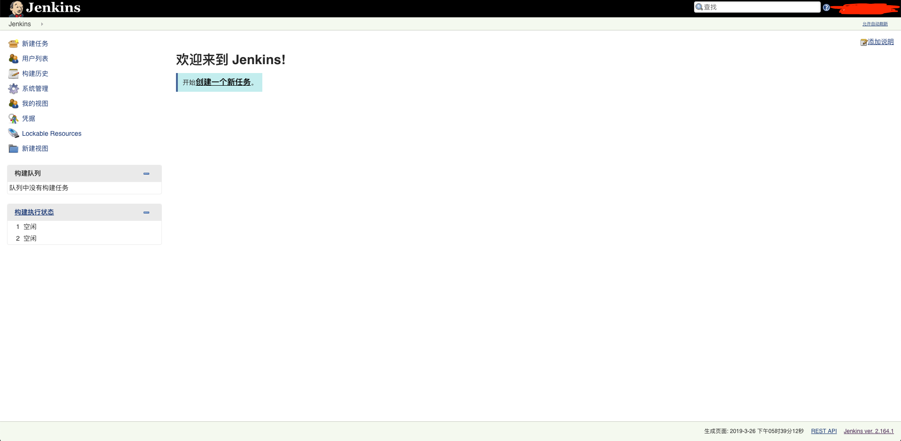
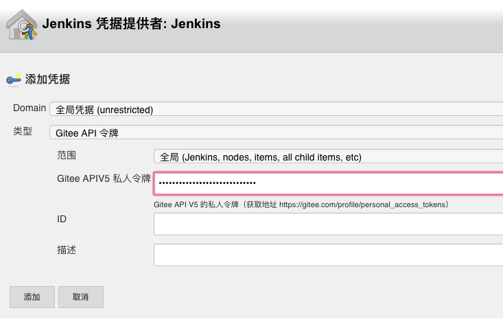
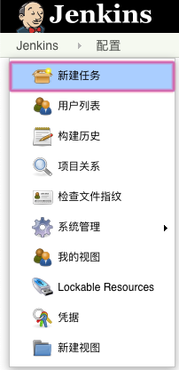
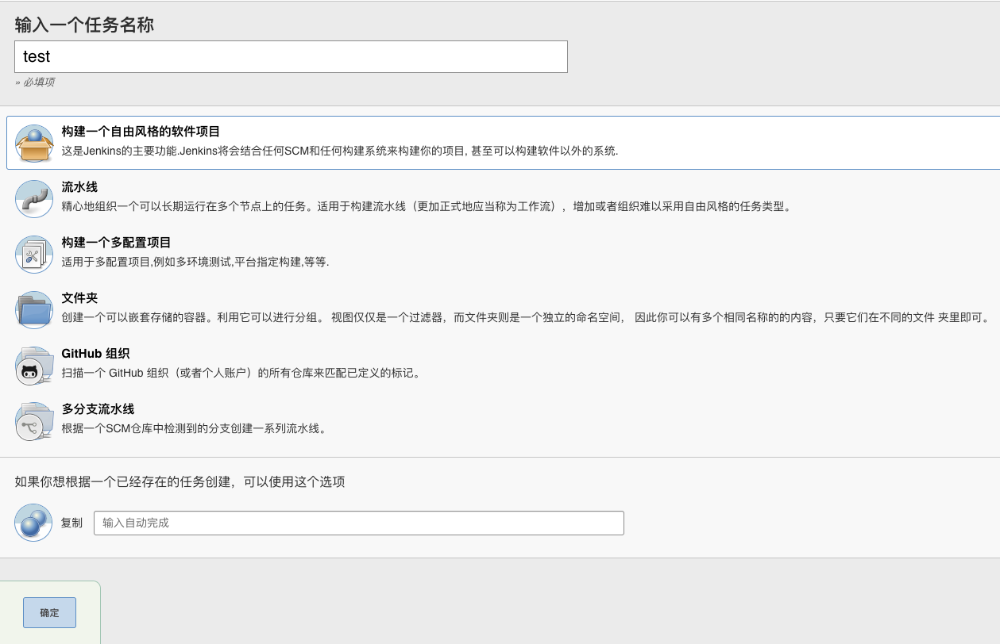

# gitee + webhooks + jenkins 实现自动化部署

作为一名前端开发扫地僧，得折腾。通过 `push` `pull request` 等操作，直接自动化部署到服务器，之后再发送邮件，这样的逼格岂不是提升了些许。。

## 自动部署大致原理

- 通过 `push` 推送代码
- `webhooks` 自动发送请求到 `jenkins`
- `jenkins` 接受到请求后，开始自动构建
- `jenkins` 构建完成后执行`shell`脚本来自动部署 => 自动触发邮件
- 实现代码自动化部署与自动发送邮件

## 首先确保服务器有 `java` 环境

1. 安装 `jdk`
``` bash
$ sudo apt-get install openjdk-8-jdk
```
2. 查看是否安装成功

``` bash
$ java -version
```

## 安装 `jenkins`

1. 安装 `jenkins`
``` bash
$ wget -q -O - https://pkg.jenkins.io/debian/jenkins-ci.org.key | sudo apt-key add -
$ sudo sh -c 'echo deb http://pkg.jenkins.io/debian-stable binary/ > /etc/apt/sources.list.d/jenkins.list'
$ sudo apt-get update
$ sudo apt-get install jenkins
```

2. `jenkins` 配置文件

``` bash
$ cat /etc/init.d/jenkins
```

3. `jenkins` 工作目录

``` bash
# 工作区目录
$ cd /var/lib/jenkins

# 日志文件
$ cat /var/log/jenkins/jenkins.log

# 配置文件 1 端口配置
$ vim /etc/default/jenkins

# 配置文件 2 
$ vim /etc/init.d/jenkins

# 重启配置
$ systemctl daemon-reload
```

4. 配置 `jenkins`

验证密码
``` bash
# 服务器密码位置
/var/lib/jenkins/secrets/initialAdminPassword
```


### 默认选择第一个，如果你有特殊需求的话，请随意


### 添加一个管理员账户


### 一路点下去


### 好吧，看来你已经成功了！



## 安装 `jenkins` 插件

### 选择 `系统管理` `插件管理`


### 在`可选插件`里面搜索 `gitee` 然后点击直接安装


### 在继续搜索插件 `Email Extension Template Plugin`

继续安装，在之后配置自动发送邮件时需要使用

## 全局配置

### 选择系统管理=>系统设置


### 选择 `gitee` 进行配置

点击添加按钮，添加一个 `jenkins` 权限


### 添加 API 令牌

[私人令牌获取地址](https://gitee.com/profile/personal_access_tokens)



### 测试连接

如果失败请向上继续重新设置


### 设置 `jenkins` 位置


设置完成！

## 新建并配置构建任务

### 点击新建任务



### 选择自由风格



### 源码管理


1. `Repository URL` 填写仓库地址
2. `Credentials` 添加你的码云账户
3. `Name` 填写 `origin`
4. `Refspec` 填写 `+refs/heads/*:refs/remotes/origin/* +refs/pull/*/MERGE:refs/pull/*/MERGE`
5. `Branch Specifier (blank for 'any')` 填写你要部署的分支

### 构建触发器

根据项目的情况自行填写。。。

