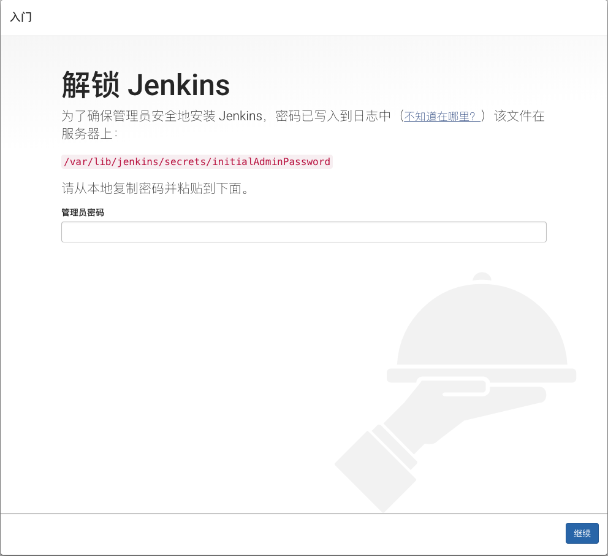
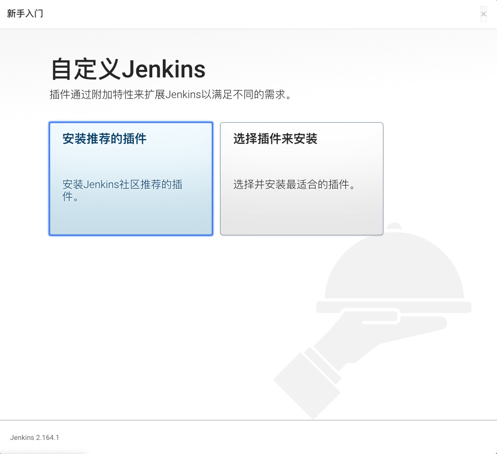

# ubuntu 安装 `jenkins`

## 首先确保服务器有 `java` 环境

1. 安装 `jdk`
```
$ sudo apt-get install openjdk-8-jdk
```
2. 查看是否安装成功

```
$ java -version
```

## 安装 `jenkins`

1. 安装 `jenkins`
```
$ wget -q -O - https://pkg.jenkins.io/debian/jenkins-ci.org.key | sudo apt-key add -
$ sudo sh -c 'echo deb http://pkg.jenkins.io/debian-stable binary/ > /etc/apt/sources.list.d/jenkins.list'
$ sudo apt-get update
$ sudo apt-get install jenkins
```

2. `jenkins` 配置文件

```${$}
$ cat /etc/init.d/jenkins

$ cat 
```

3. `jenkins` 工作目录

```
# 工作区目录
$ cd /var/lib/jenkins

# 日志文件
$ cat /var/log/jenkins/jenkins.log

# 配置文件 1 端口配置
$ vim /etc/default/jenkins

# 配置文件 2 
$ vim /etc/init.d/jenkins

# 重启配置
$ systemctl daemon-reload
```

4. 配置 `jenkins`

验证密码
```
# 服务器密码位置
/var/lib/jenkins/secrets/initialAdminPassword
```



默认选择第一个，如果你有特殊要求的话，请随意


