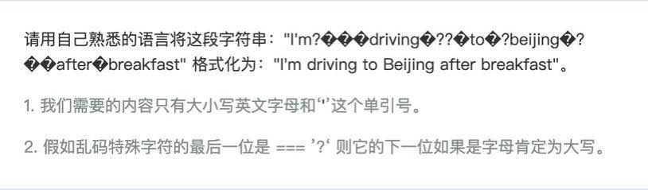

**以下写法均为个人解答，不代表正确性**，有兴趣可以自己写写～

## 题 1



::: details 点击查看代码
``` js

function getString (string) {
  const Reg = /^[a-zA-Z]*$/
  const newString = []
  const stringArr = string.split('')
  let preString = ''
  
  for (const str of stringArr) {
    if (Reg.test(str) || str === "'") {
      if (preString === '?') {
        newString.push(str.toUpperCase())
      } else {
        newString.push(str)
      }
    }
    preString = str
  }
  return newString.join('')
}

const string = `I'm?？？？driving？??？to？?beijing？?？？after？breakfast`

console.log(getString(string))

```
:::


## 题 2


::: details 点击查看代码
``` js

const numberList = []

function getNumberList (start, end) {
  start = parseInt(start)
  end = parseInt(end)
  if (start <= end) {
    if (start > 0 && start % 3 === 0) {
      numberList.push(start)
      getNumberList(start + 3, end)
    } else {
      getNumberList(++start, end)
    }
  }
}

getNumberList(1, 100)

console.log(numberList)

```
:::


## 题 3


::: details 点击查看代码
``` js

let startDay = {
  hour: 1,
  timer: null,
  setup (user) {
    console.log(`${user} 起床啦`)
  },
  brush (user) {
    console.log(`${user} 去刷牙呢`)
  },
  work (user) {
    console.log(`${user} 去工作啦`)
  },
  sleep (user) {
    console.log(`${user} 要睡觉啦`)
  },
  coding (user) {
    console.log(`${user} 开始写代码啦`)
  },
  demand (user) {
    console.log(`${user} 的需求评审`)
  },
  daily (user) {
    console.log(`${user} 写日报`)
  },
  start () {
    if (this.hour >= 1 && this.hour < 24) {
      switch (this.hour) {
        case 8:
          execute(this.hour)
          break
        case 9:
          execute(this.hour)
          break
        case 10:
          execute(this.hour)
          break
        case 11:
          execute(this.hour)
          break
        case 16:
          execute(this.hour)
          break
        case 22:
          execute(this.hour)
          break
        default:
          break
      }
    } else {
      this.hour = 0
    }
  },
  open () {
    console.log('开始了')
    this.timer = setInterval(() => {
      console.log(this.hour + '点')
      this.start()
      this.hour += 1
    }, 1000)
  },
  close () {
    clearInterval(this.timer)
    this.timer = null
    console.log('stop')
  }
}
const config = {
  my: {
    8: startDay.setup,
    9: startDay.brush,
    10: startDay.work,
    22: startDay.sleep
  },
  a: {
    10: startDay.coding,
    16: startDay.demand,
    22: startDay.daily
  },
  b: {
    11: startDay.coding,
    23: startDay.daily
  }
}

function execute (hour) {
  config.my[hour] && config.my[hour]('我')
  config.a[hour] && config.a[hour]('小 a')
  config.b[hour] && config.b[hour]('小 b')
}

startDay.open()

```
:::