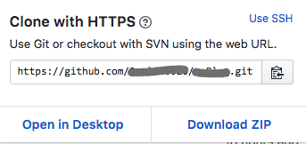

# 使用 github 对代码进行托管

## 首先确保你的 github 账户存有你的公钥

```
cd ~/.ssh
ls
```
查看有没有 id_rsa.pub 文件，如果没有运行 `ssh-keygen -t rsa -C 'Your Email'` 生成公钥

一路回车，会发现一个 `id_rsa` 和 'id_rsa.pub' 文件

```
# id_rsa.pub 存放你的公钥。
# 查看当前公钥，将内容复制到 github 上
cat id_rsa.pub
```
## 验证是否连接到 github

```
ssh -T git@github.com
```
运行后应该出现
`Hi usename! You've successfully authenticated, but GitHub does not provide shell access.`
代表连接成功，之后就可以对你的仓库进行操作了

## 在 push 时提示 Permission denied (publickey) 的情况

请按照上述方法，删除原有公钥，进行重试，如果不行的话。看本地的 `.git/config` 设置的仓库 url 地址和 github 使用的链接地址是否一致



``` shell{11}
cat .git/config

[core]
        repositoryformatversion = 0
        filemode = true
        bare = false
        logallrefupdates = true
        ignorecase = true
        precomposeunicode = true
[remote "origin"]
        url = https://github.com/<USERNAME>/<REPO>.git
        fetch = +refs/heads/*:refs/remotes/origin/*
[branch "master"]
        remote = origin
        merge = refs/heads/master
```
