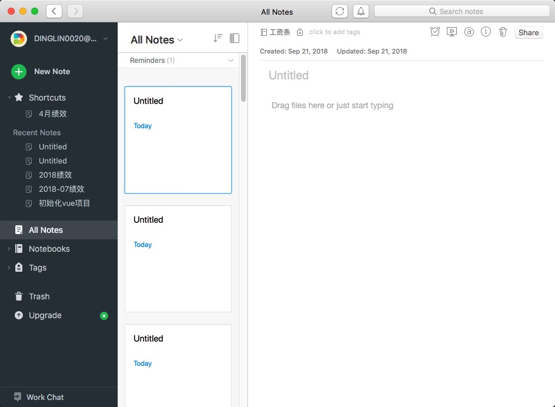
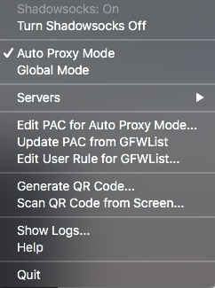
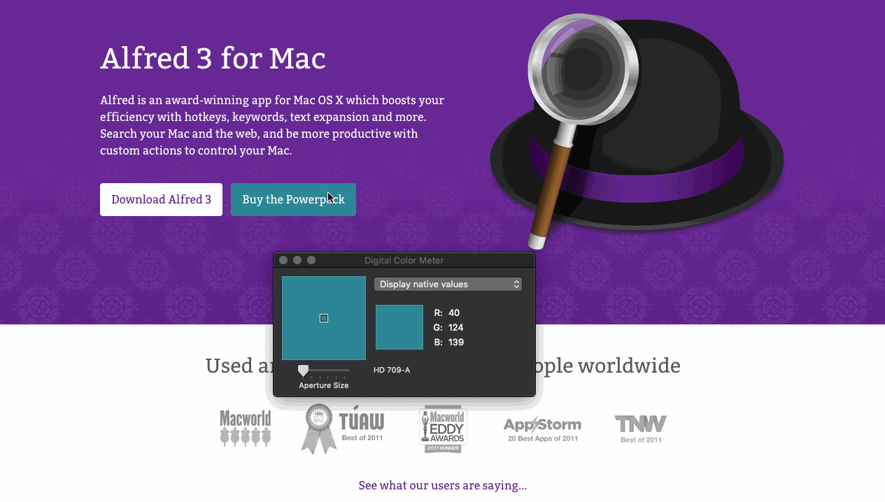
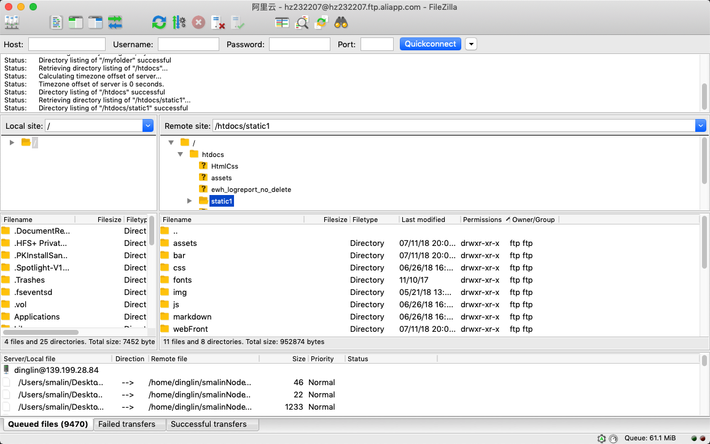
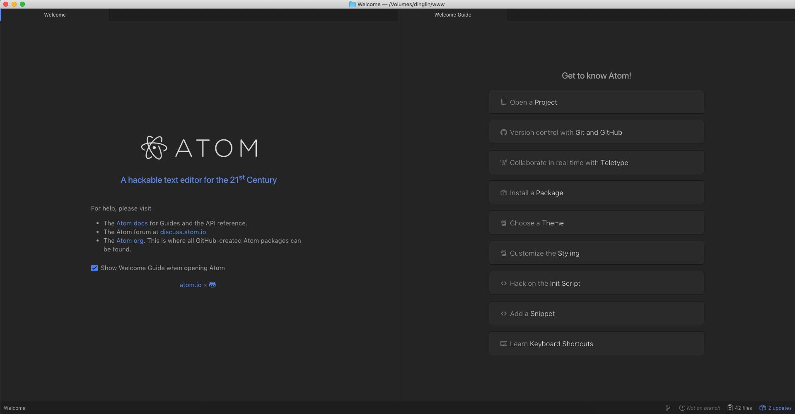
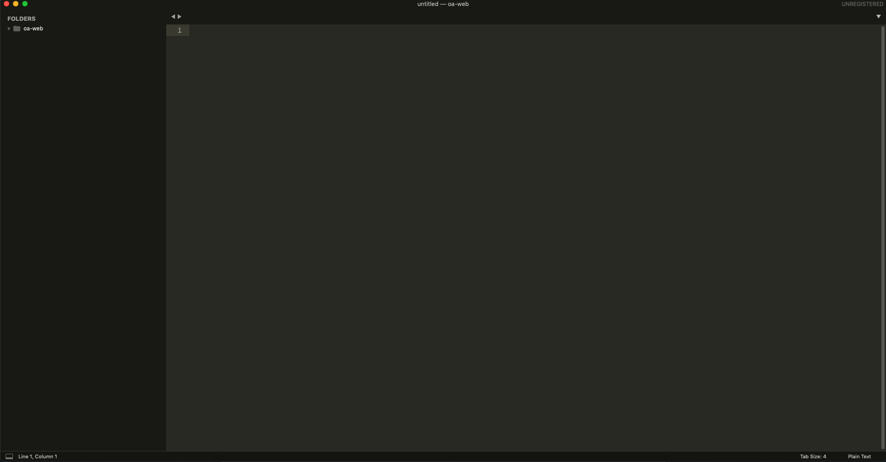
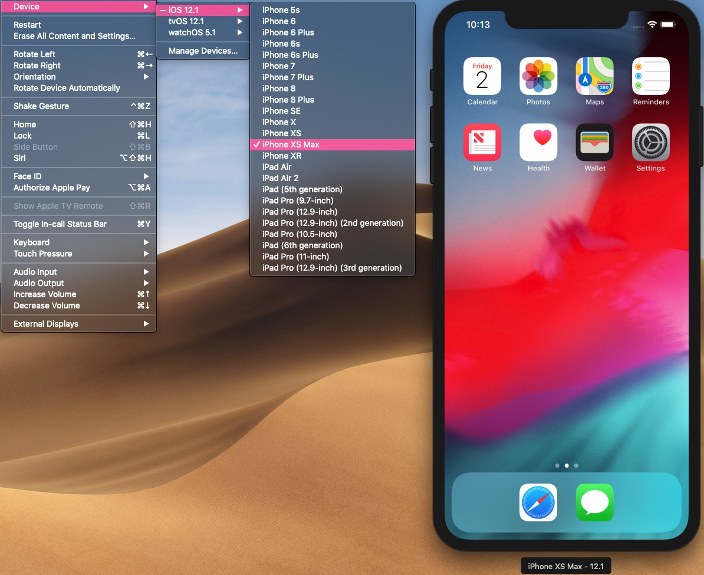

# Mac OS X 下的实用工具

## 偏向日常使用办公的工具

## 1.Duet Display

- 一款Mac OS X下的分屏软件，可以将你现在拥有的iPhone，iPad等设备与Mac或者Windows PC进行连接，扩展为第二块屏幕的一款软件
- Duet 通过 USB 数据线传输画面。清晰度、稳定性、流畅度都还可以。即使开启 Retina 视网膜分辨率，仍能保持 60 FPS，并且还支持开启Touch Bar功能
- 该软件在App store里售价98RMB
- 缺点：售价小贵，连接时必须在Mac或者Windows PC上进行USB连接等

## 2.EverNote

- Evernote（印象笔记）是一款多功能笔记类应用，它可以跨终端，跨平台使用。
- 移动设备：iOS、watch OS、Android、Windows Phone、Blackberry
- 电脑端：Linux，Mac OS X，Windows
- Web端：移动网页版和web版
- 一端保存，多端同步。支持MarkDown编写方式

- 特性：保持同步、剪辑网页、深度搜索、储存重要资料、团队协作、支持第三方
### 用户区别：
<table>
  <thead>
    <th v-for="item in head">
      {{ item.name }}
    </th>
  </thead>
  <tbody>
    <tr v-for="item in body">
      <td> {{ item.name }} </td>
      <td> {{ item.freeUser }} </td>
      <td> {{ item.standardUser }} </td>
      <td> {{ item.advancedUser }} </td>
    </tr>
  </tbody>
</table>

## 3.MacDown
 
[markdown语法学习地址](https://www.appinn.com/markdown/)
- 一款免费的，在Mac下表现良好的MarkDown实时编辑器

- 可以实现实时显示当前MarkDown语法进行预览

## 4.Parallels Desktop

- 一款Mac OS X下的虚拟机软件，可以运行Windows，Linux等常用系统
- 一款收费软件，具体价钱可以去[官网](https://www.parallels.com/cn/)自行了解

- 安装系统界面

## 5.Shadowsocks

- 一款免费的科学上网工具。[如何自己搭建一个VPN服务器](https://moshuqi.github.io/2017/07/20/%E8%87%AA%E5%B7%B1%E6%90%AD%E5%BB%BAVPN%E6%9C%8D%E5%8A%A1%E5%99%A8/)
[补充一个梯子网站](https://www.vultr.com/)

<!--  -->

## 6.TeamViewer

### 什么是TeamViewer?

- TeamViewer是一个能在任何防火墙和NAT代理的后台用于远程控制的应用程序，桌面共享和文件传输的简单且快速的解决方案。为了连接到另一台计算机，只需要在两台计算机上同时运行 TeamViewer 即可，而不需要进行安装（也可以选择安装，安装后可以设置开机运行）。该软件第一次启动在两台计算机上自动生成伙伴 ID。只需要输入你的伙伴的ID到TeamViewer，然后就会立即建立起连接。

## 7.Licecap

- 一款轻量级录制GIF图片的软件

## 8.Dozer
- 一款在 Mac OS X 上可以收缩应用栏的软件，类似于 windows 的“自定义通知区域”功能

[GitHub](https://github.com/Mortennn/Dozer)
  
## 9.Alfred 3

- 一款在Mac OS X届中，被称之为神器的一款软件
- Alfred是Mac OS X的一款获奖应用，它可以通过热键、关键字、文本扩展等功能提高效率。搜索你的Mac和网络，用定制的动作来控制你的Mac会更有效率。
- [Alfred 官网](https://www.alfredapp.com/)售价19英镑

---

- 个人经常使用的方法

1. 翻译单词
2. 打开应用
3. 快速搜索
4. 计算器

- [Alfred 3 使用手册](https://sspai.com/post/44624)

## 偏向开发类工具

## 1.iTerm 2
- 一款Mac OS X下的终端工具
- 替代Mac OS X下的终端工具
- 简单操作指令

1. 横向分屏：Command + D
2. 竖向分屏：Command + Shift + D
3. 找不到光标时：Command + /
4. 命令时间轴：Command + Shift + E

## 2.Digital Color Meter

- Mac OS X自带的颜色拾取器

## 3.Postman

- 前后端开发人员必备软件
- 用于接口请求，调试接口的工具

## 4.FileZilla

- FileZilla是一个免费开源的FTP软件

## 5.SequelPro

- 一款免费的Mac OS X下的数据库管理软件

## 6.Visual Studio Code - Insiders

### Visual Studio Code 和 Visual Studio Code - Insiders 的区别
1. Visual Studio Code 稳定版：功能相对比较稳定
2. Visual Studio Code - Insiders 先行版：微软在开发完一个版本，就会放上来的一个版本，可供用户测试使用，如果在Insiders版没有问题，并且用户反馈良好的话，一般会在两周左右，将功能加入在线上稳定版本里。
### 什么是 Visual Studio Code ？
- 微软在发布Windows 10版本的时候放出的一款免费，开源的编辑器
- 官方定义：它是一款免费的，开源的，跨平台的编辑器
- 开发Visual Studio Code的团队最早之前开发的Eclipse，相信大家耳熟能详，吸取了Eclipse的教训，Visual Studio Code把插件系统运行在了主进程之外。高度可定制，但是又是可控的
- 是一款用 JavaScript 编写的编辑器，可以使用 JavaScript 语言来编写插件
- 另外两款比较知名的编辑器是GitHub开发的Atom和Sublime，还有一款Webstorm都是比较不错的

1. Visual Studio Code: 运行速度没有 Sublime 快

2. Atom：体积大，运行速度最慢  （编写语言为JavaScript)

3. Sublime：收费（有体验版，可以无限体验，相当于免费），不开源 (编写语言为Python)

4. Webstorm：收费，定位IDE

## 7.Simulator

一款只要是 Mac OS X 系统，就有 Xcode 只要有 Xcode 就有它的一款软件

哦哦哦，其实它是一款模拟 iPhone, iPad 等常用设备的一款软件，其实是为了给 IOS 开发者使用的一款模拟器

但是作为前端，难免会做一些移动端的网站，安卓的适配使用 Chrome 自带的 Device toolbar 就足够了。

但是 IOS 它不干啊，它有自己的傲娇，所以我们需要这一款软件来对移动端的开发进行测试

优点是免费开源，出了 iPhone iPad 等新机型直接就会在 Simulator 菜单栏中

一个国内不错的 Mac 软件网站 https://xclient.info/

